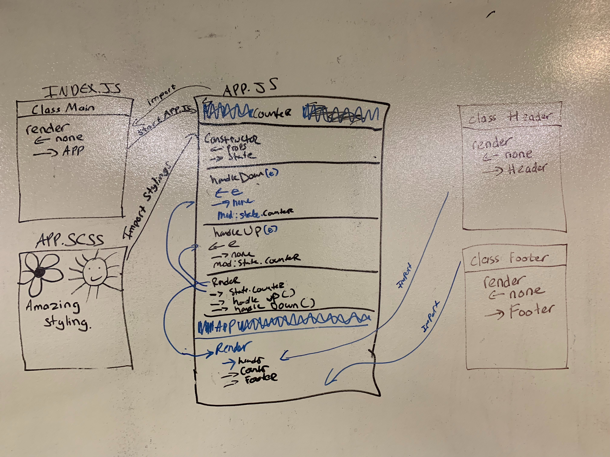

 LAB
=================================================

## Project Name

### Author: Student/Group Name

### Links and Resources
* [Warmup](https://repl.it/@haitle16/Destructuring-and-Spread)
* [Lab-26](https://codesandbox.io/s/x3q1vrk1yz)

### Modules

###### `app.scss -> app.js`
Import the stylings into our web application

###### `index.js`
Import app.js and start the APP.

###### `header.js`
Export into app.js and render the header component.
In this case, header component is `Hello!`

###### `footer.js`
Export into app.js and render the footer component.
In this case, footer component is `&copy; 2018 Code Fellows`

###### `app.js`
constructor() take in `props` and declare the `state`

implementCounter() - Implement the counter by adding 1 to `this.state.counter`

decrementCounter() - Decrement the counter by subtracting 1 to `this.state.counter`

updateCounter() - Declare words and setstate. This is a helper function for implementCounter() and decrementCounter()

render() - Render the Counter Class and its functions inhtml format.

Lastly, Export the App, which got called inside index.js

#### Running the app
* On the repl.it Click the `Run` Button to start
* On the codepen just play with the functionalities on `Browsers`

#### UML
Link to an image of the UML for your application and response to events

